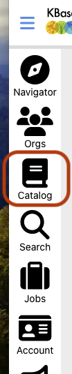
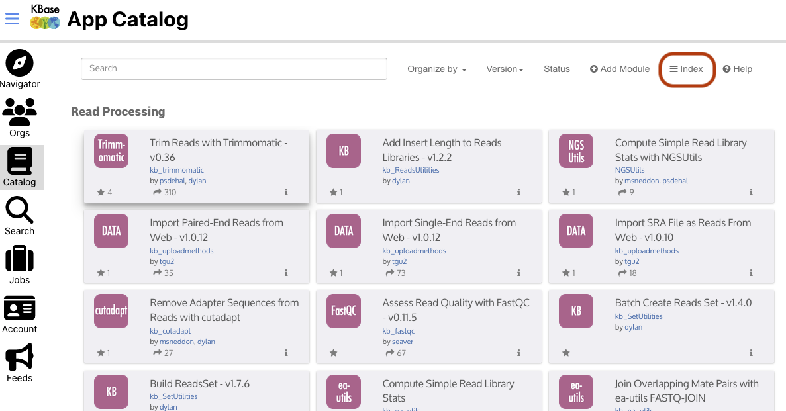
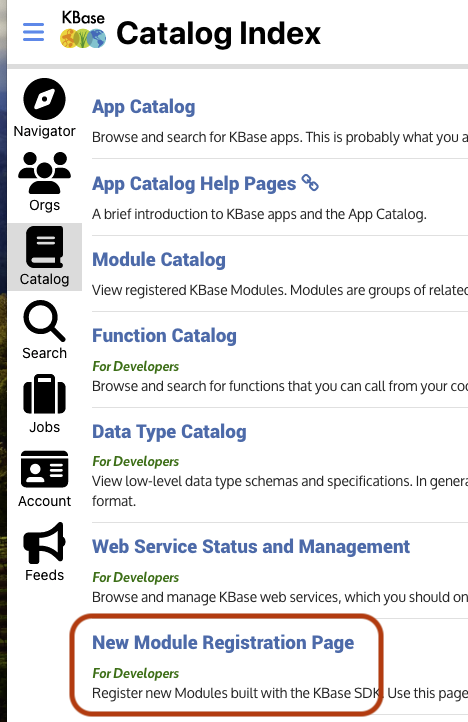
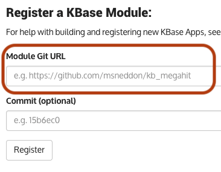
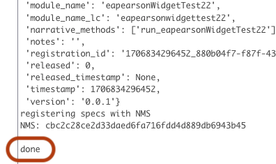

# Publishing Your Service

So you've created a dynamic service, added some cool widgets, and you want it to be
available for use in Narratives?

To do this, you'll need to:

- create a GithHub Repo
- push your local code upt to the github repo
- register your app in the Catalog
- utilize the Narrative's widget developer tool to insert the widget into a narrative

## Prerequisites

In order to register your service and have it available for usage within KBase, you need
to have a KBase account, and have developer access for that account.

> TODO: write this up

## Create Github Repo

All KBase apps, including dynamic services, reside in the GitHub organization
[kbaseapps](https://github.com/kbaseapps).

In order to use a KBase app within a Narrative, it must first be registered. We'll get
to that later, but I wanted to note this because of a restriction this places on GitHub
app repos -- they __must__ be located in the `kbaseapps` organization. This is because
once an app is registered within KBase, there is no automated process for moving an app
repo from it's original location.

> ...
>
> TODO: document here how to create a repo within `kbaseapps`
>
> ...

Once you have created the repo, GitHub will provide instructions for pushing an existing
from the command line. Leave that page up, because we'll copy a copy of lines for our usage.

## Push code to repo

Once the repo is created, you are ready to push your app up to the repo.

> These instructions are for the command line, as a reference; of course you are free to
> use another process, such as git support in your favorite IDE.

If you have followed the [instructions](./creating-dynamic-service-for-widgets-tldr.md),
the service will already be configured as a GitHub repo.

1. We'll first need to add the GitHub repo as a "remote".

    From within the service directory, if you are using ssh with github:

    ```shell
    git remote add origin ssh://git@github.com/kbaseapps/yourusernameYourModuleName
    ```

    or if you are using https:

    ```shell
    git remote add origin https://github.com/kbaseapps/yourusernameYourModuleName
    ```

    To confirm the setting, you can issue:

    ```shell
    git remote -v
    ```

    and you should see

    ```shell
    origin	ssh://git@github.com/kbaseapps/yourusernameYourModuleName (fetch)
    origin	ssh://git@github.com/kbaseapps/yourusernameYourModuleName (push)
    ```

    or the https variant.

2. Next, push the repo up!

    ```shell
    git push -u origin main
    ```

    > You only need the `-u` (set-upstream) option the first time you push to github.

3. Confirm the push

    While on the github web page you had previously left open, refresh it. You should
    see the instructions replaced with the contents of your service repo.

## Register app

Registering an app with KBase is actually very simple.

> NOTE: update for the app

1. Take your browser to kbase: `https://ci.kbase.us`

2. Sign in with your KBase account that has developer access

3. Once signed in, navigate to the "Catalog", via the icon on the left side of the page.

    

4. Then navigate to the "Index" menu.

    

5. Then navigate to the "New Module Registration Page"

    

6. In the "Register a KBase Module:" form, paste the url for your repo into the "Module
   Git URL" field. You can get this url from the browser when you are on the repo's
   initial page.

    

7. You do not need to fill in the commit -- the Catalog registration will pull your repo
   from the most recent commit.

8. Click the "Register" button

9. The catalog will proceed to build and then register your service! If all goes well a
   simple message will be displayed at the bottom of the log display:

   ```text
   done
   ```

   

## Next Steps

You probably want to use your newly registered dynamic service widgets in a Narrative?
Check out [Using Demo Widgets](./using-demo-widgets.md) to find out how.