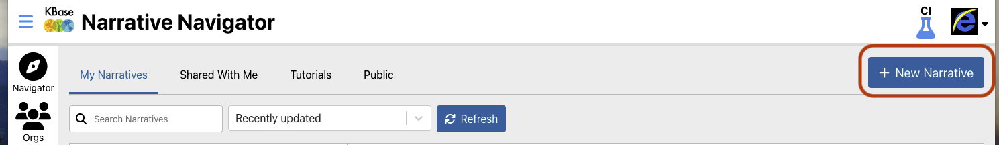
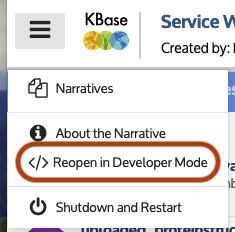
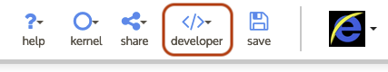
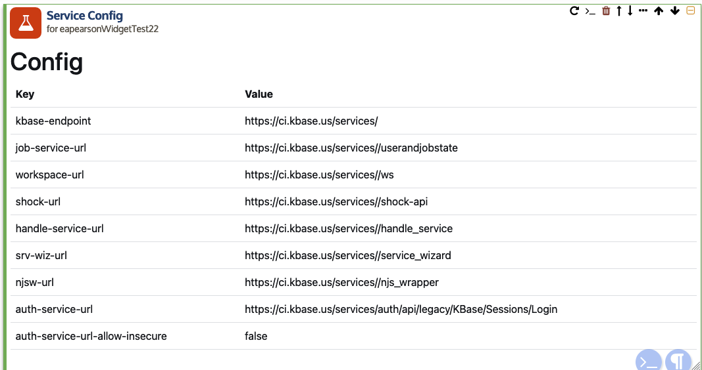

# Use widget developer tool to insert demo widgets into Narrative

Your dynamic service widgets should now be available for usage in the narrative.

For purposes of this document, we'll assume that you have installed the demo widgets. If
you have removed them and created your own, you can translate these instructions to your
own case.

We'll be using the widget developer tool to ensure that your widgets appear correctly in
the narrative. It is important to note that typical usage of your widget will only be
possible:

- if a data viewer, the [NarrativeViewers](./updating-narrative-viewers.md) have been
updated and redeployed

- if an app output viewer, the app is available and registered, and has the [proper
configuration for widgets](./configuring-apps.md).

We'll formulate these instructions for the use case of creating a demonstration
Narrative in order to evaluate and/or share the progress of your widgets.

1. Open a new o Narrative

    Use the Navigator to open a new Narrative.

    

2. Re-open the Narrative in developer mode

    From the hamburger menu (upper left corner of the page), select "Reopen in Developer
    Mode".

    > If this menu option is not available, you have not been registered as a KBase
    > developer.

    

    (After reopening in developer mode, you may return to "User Mode" at any time by
    reselecting the menu item, whose label will have become to "Reopen in User Mode".)

    Once reopened in developer mode, a new "developer" menu item will appear in the top
    menu

    

3. Use the "developer" menu to insert the "config" widget

    Open the developer menu and select the "Insert Generic Service Widget" item.

    

    You should now see a new cell in the Narrative that looks like:

    

4. Use the "developer" menu to insert the "media viewer" widget

    > TO BE WRITTEN
